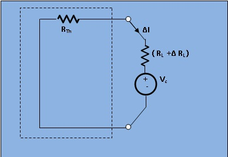

### Theory

In a linear time invariant network when the resistance `(R)` of an uncoupled branch, carrying current (I), is changed by &Delta;RL , the currents in all the branches would change and can be obtained by assuming that an ideal voltage source of Vc  has been connected such that Vc=I&Delta;RL in series with R+&Delta;RL when all other sources in the network are replaced by their internal resistances. 

 <h2>Explanation :&nbsp;&nbsp;</h2>

Let us assume a load `R_L` connected to a dc source network whose thevenin's equivalent gives Vo as the Thevenin's voltage and RTh as Thevenin resistance.
 
 <figure style="text-align:center">

 <figcaption>[ Fig. 1. Thevenin Equivalent Circuit ]</figcaption>
</figure>
 
 <figure style="text-align:center">

 <figcaption>[ Fig.2 (a) . Explanation of Compensation theorem ]</figcaption>
</figure>
 
 <figure style="text-align:center">

<figcaption>[  Fig.2 (b) . Explanation of Compensation theorem ]</figcaption>
</figure>
 

Let the load resistance Rl be changed to R+&Delta;RL.Since the rest of the circuit remains unchanged,the Thevenin equivalent network remains the same.This Change of current being termed as &Delta;I , we find
 								
										
$$\Delta I = I' - I$$

&nbsp;&nbsp;&nbsp;&nbsp; 
$$= \frac{V_o}{(R_{Th} + R_L + \Delta R_L} - \frac{V_o}{(R_{Th} + R_L)}$$
 

&nbsp;&nbsp;&nbsp;&nbsp;
$$= \frac{V_o (-\Delta R_L)}{(R_{Th} + R_L)(R_{Th} + R_L + \Delta R_L)}$$
 

&nbsp;&nbsp;&nbsp;&nbsp; 
$$= -\frac{V_c}{R_{Th} + R_L + \Delta R_L} .......(3)$$
 

$$V_c = I \Delta R_L$$
									

This voltage Vc is termed as compensating voltage.

